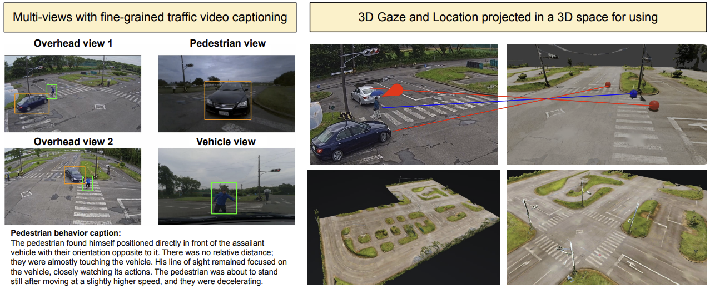
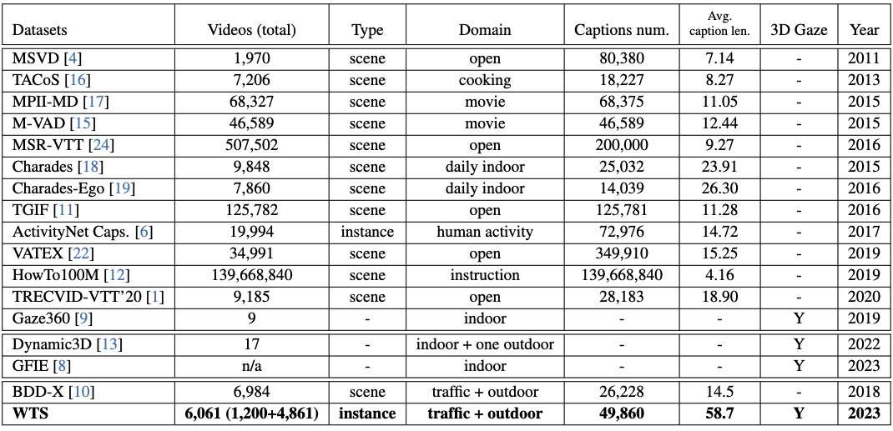

<div id="top" align="center">

<p align="center">
  
</p>

**WTS:A Pedestrian-Centric Traffic Video Dataset for Fine-grained Spatial-Temporal Understanding**

Dataset download [**link**](https://docs.google.com/forms/u/1/d/e/1FAIpQLSe6eshgQQyf1wZmJkgnqsoDaFb_h-673qG7VHPxapkhh30_Gw/viewform?usp=send_form) (serves as official source for [`AI City Challenge 2024 Track2 @ CVPR2024`](https://www.aicitychallenge.org/2024-challenge-tracks/))
</div>

<div id="top" align="center">
  
[](#licenseandcitation)
[](#datastructure)
[](https://woven-visionai.github.io/wts-dataset-homepage/)
</div>

## News and Updates</a>

### News <a name="news"></a>

- **`[2024/01/22]`** [AI City Challenge 2024 Track2](https://www.aicitychallenge.org/2024-challenge-tracks/) opened.
- **`[2024/01/22]`** WTS dataset released.
- **`[2024/01/21]`** WTS dataset [project page](https://woven-visionai.github.io/wts-dataset-homepage/) released.

### Update List <a name="update"></a>

- [ ] Generated bbox for target pedesrian and vehicle.
- [ ] Evaluation code.
- [ ] Dataset arXiv paper 

## WTS Dataset <a name="introduction"></a>

The [Woven Traffic Safety (WTS) Dataset](https://woven-visionai.github.io/wts-dataset-homepage/) is designed to emphasize detailed behaviors of both vehicles and pedestrians within a variety of staged traffic events including accidents.
Comprising over 1.2k video events across over 130 distinct traffic scenarios, WTS integrates diverse perspectives from vehicle ego and fixed overhead cameras in a vehicle-infrastructure cooperative environment.
Each event in WTS is enriched with comprehensive textual descriptions of the observed behaviors and contexts.
For diverse experimental purposes, we also provide the same detailed textual description annotations for approximately 4.8k publicly sourced pedestrian-related traffic videos from BDD100K for external use as training/test resources, etc.

## Features and Comparison <a name="feature"></a>

WTS provides the largest number of videos with long fine-grained video descriptions with 3D spatial information in the traffic domain.
<p align="center">
  
</p>

## Dataset Structure <a name="datastructure"></a>
we have two kinds of video data provided for use:
- Collected real-world WTS data including traffic accidents.
- Filtered pedestrian-centric videos from [BDD100K](https://www.vis.xyz/bdd100k/) data with our WTS annotations as `BDD_PC_5K`

**Video Data**

All collected WTS video data are stored under the `videos` folder. 
For the multiple-view videos, part of the scenarios will proceed across the views.
We provide the bbox annotations for the target pedestrian and vehicle for selecting the target video once needed. 
```
videos
├── train
│   ├── 20230707_12_SN17_T1  ##scenario index
│   │   ├── overhead_view    ##different overhead view about the scenario
│   │   │   ├── 20230707_12_SN17_T1_Camera1_0.mp4
│   │   │   ├── 20230707_12_SN17_T1_Camera2_3.mp4
│   │   │   ├── 20230707_12_SN17_T1_Camera3_1.mp4
│   │   │   └── 20230707_12_SN17_T1_Camera4_2.mp4
│   │   └── vehicle_view  ##vehicle ego-view about the scenario
│   │       └── 20230707_12_SN17_T1_vehicle_view.mp4
│   ├── 20230707_15_SY4_T1
│   │   ├── overhead_view
│   │   │   ├── 20230707_15_SY4_T1_Camera1_0.mp4
│   │   │   ├── 20230707_15_SY4_T1_Camera2_1.mp4
│   │   │   └── 20230707_15_SY4_T1_Camera3_2.mp4
│   │   └── vehicle_view
│   │       └── 20230707_15_SY4_T1_vehicle_view.mp4
...
```
All pedestrian-related videos from BDD are stored under `external` folder:
```
external/
└── BDD_PC_5K
    ├── videos
    │   ├── train
        │   ├── video1004.mp4
        │   ├── video1006.mp4
        │   ├── video1009.mp4
        │   ├── video100.mp4
        │   ├── video1015.mp4
...
```

**Annotation**

Two kinds of annotations now are available. 
- BBox for the target pedestrian and vehicle.
- Description for the traffic scenario focuses on the `location, attention, behavior, context` regarding the pedestrian and vehicle.

Will update the 3D Gaze and Location annotations for use (stay tuned).

Caption annotations for each scenario, notice that multi-view videos share the same caption:
```
annotations
├──caption/
  ├── train
  │   ├── 20230707_12_SN17_T1 ##scenario index
  │   │   ├── overhead_view   
  │   │   │   └── 20230707_12_SN17_T1_caption.json   ##caption shared by multiple views
  │   │   └── vehicle_view   
  │   │       └── 20230707_12_SN17_T1_caption.json   ##caption is the same as overhead view, only timestamp is for vehicle view for finding the same segment.
  │   ├── 20230707_15_SY4_T1
  │   │   ├── overhead_view
  │   │   │   └── 20230707_15_SY4_T1_caption.json
  │   │   └── vehicle_view
  │   │       └── 20230707_15_SY4_T1_caption.json
...
```
Caption JSON format:
```
{
    "id": 722,
    "overhead_videos": [ ## caption related videos
        "20230707_8_SN46_T1_Camera1_0.mp4",
        "20230707_8_SN46_T1_Camera2_1.mp4",
        "20230707_8_SN46_T1_Camera2_2.mp4",
        "20230707_8_SN46_T1_Camera3_3.mp4"
    ],
    "event_phase": [
        {
            "labels": [
                "4"  ##segment number
            ],
            "caption_pedestrian": "The pedestrian stands still on the left side behind the vehicle, ...",  ##caption for pedestrian during the segment
            "caption_vehicle": "The vehicle was positioned diagonally to ...",  ##caption for vehicle during the segment
            "start_time": "39.395",  ##start time of the segment in seconds, 0.0 is the starting time of the given video.
            "end_time": "44.663"     ##end time of the segment in seconds
        },
...
```

BBox annotations for the first frame of each segment in the video, notice that not all videos have the bbox as there are some views that can not cover the pedestrian or vehicle.
```
annotations
├── bbox_annotated ##bbox for the first frame of each segment
│   ├── pedestrian  ##bbox for pedestrian and vehicle respectively 
│   │   ├── train
│   │   │   ├── 20230707_12_SN17_T1
│   │   │   │   └── overhead_view
│   │   │   │       ├── 20230707_12_SN17_T1_Camera1_0_bbox.json  ##bbox for per video
│   │   │   │       ├── 20230707_12_SN17_T1_Camera2_3_bbox.json
│   │   │   │       ├── 20230707_12_SN17_T1_Camera3_1_bbox.json
│   │   │   │       └── 20230707_12_SN17_T1_Camera4_2_bbox.json
...
```
BBox annotations for the whole frames generated by the video object tracking method for each segment in the video:
```
annotations
├── bbox_generated  ##bbox for the whole frame of each segment
│   ├── pedestrian  ##bbox for pedestrian and vehicle respectively
│   │   ├── train
│   │   │   ├── 20230707_12_SN17_T1
│   │   │   │   └── overhead_view
│   │   │   │       ├── 20230707_12_SN17_T1_Camera1_0_bbox.json  ##bbox for per video
│   │   │   │       ├── 20230707_12_SN17_T1_Camera2_3_bbox.json
│   │   │   │       ├── 20230707_12_SN17_T1_Camera3_1_bbox.json
│   │   │   │       └── 20230707_12_SN17_T1_Camera4_2_bbox.json
...
```
BBox format follows COCO format, you could use our `frame_extraction` script to reproduce the frames with `image_id`.
```
{
    "annotations": [
        {
            "image_id": 904, ## frame ID
            "bbox": [
                1004.4933333333333, ## x_min 
                163.28666666666666, ## y_min
                12.946666666666667, ## width
                11.713333333333333  ## height
            ],
            "auto-generated": false,  ##human annotated frame
            "phase_number": "0"
        },
        {
            "image_id": 905,
            "bbox": [
                1007.1933333333333,
                162.20666666666668,
                12.946666666666667,
                11.713333333333333
            ],
            "auto-generated": true,  ##generated bbox annotation for the frame
            "phase_number": "0"
        },
...
```

For BDD, each caption annotations correspond with one video for use.
The annotation format is the same as our collected data caption annotations.
```
external/
└── BDD_PC_5K
    ├── annotations
    │   ├── train
    │   │   ├── video1004_caption.json
    │   │   ├── video1006_caption.json
    │   │   ├── video1009_caption.json
    │   │   ├── video100_caption.json
    │   │   ├── video1015_caption.json
...
```

## Data Preparation

Our BBox annotation is frame-based, you could use the below script to extract the frame to align the ID in our annotations.
```
python script/frame_extraction.py
```

## Evaluation

We provide the validation set for the video2text task with a given segment duration.
Video and its GT of the validation set are stored following the same structure as `train` under `val` folders.

For our collected data in WTS, the inference results are required to be provided per scenario. 
Users could feel free to use the multi-view videos in the same scenario folders for validation purposes, 
as well as multi-view videos in `train` for training purposes.
For `BDD_PC_5K`, each video has its caption GT in `train` and `val`, and validation will be done per video.

Regarding `AI City Challenge 2024 Track2`, the evaluation script will be provided under `evaluation/` soon, notice that only caption annotations will be used for the challenge.
Submission(model output) format is defined as:
```
{
    "20230707_12_SN17_T1": [  ##scneario index
        {
            "labels": [  ##segment number, this is known information will be given
                "4"
            ],
            "caption_pedestrian": "",  ##caption regarding pedestrian 
            "caption_vehicle": ""      ##caption regarding vehicle
        },
        {
            "labels": [
                "3"
            ],
            "caption_pedestrian": "",
            "caption_vehicle": ""
        },
        {
            "labels": [
                "2"
            ],
            "caption_pedestrian": "",
            "caption_vehicle": ""
        },
        {
            "labels": [
                "1"
            ],
            "caption_pedestrian": "",
            "caption_vehicle": ""

        },
        {
            "labels": [
                "0"
            ],
            "caption_pedestrian": "",
            "caption_vehicle: ""
        }
    ]
}
```
## Annotation Manner <a name="licenseandcitation"></a>

will be updated with the arXiv paper soon.

## License and Citation <a name="licenseandcitation"></a>

please refer to our dataset [project page](https://woven-visionai.github.io/wts-dataset-homepage/)
