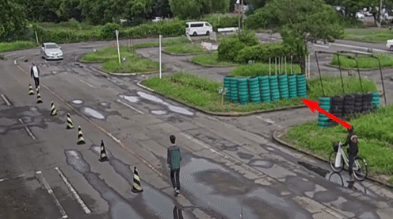
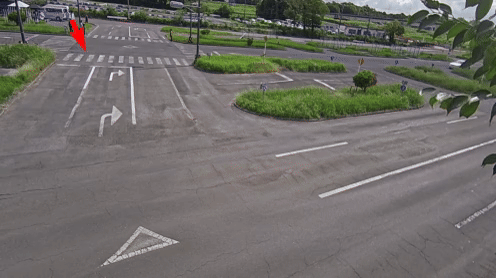
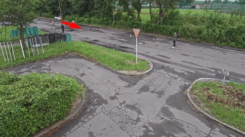

# Gaze Visualization

## 3D Gaze

3D Gaze is also provided for each camera for given dates and the structure is shown below:

```
annotations
├── 3D_gaze
│   ├── train
│   │   ├── 20230922_1_SN2_T1
│   │   │   ├── 20230922_1_SN2_T1_192.168.0.11-1_gaze.json  ## Gaze per camera video 
│   │   │   ├── 20230922_1_SN2_T1_192.168.0.12-2_gaze.json
│   │   │   └── 20230922_1_SN2_T1_192.168.0.28-3_gaze.json
...
```
Gaze annotation follows the similar structure as BBox, as shown below. The gaze (x, y, z) is in overhead camera coordinates in OpenGL axis convention (x to the right, y up, and z backward). `image_id` refers to the frame number in the overhead video.

```
{
    "annotations": [
        {
            "image_id": 0, ## frame ID
            "gaze": [
                0.7267333451506679, ## x
                0.27087537465994793, ## y
                -0.6312568142259175 ## z
            ],
        },
        {
            "image_id": 1,
            "gaze": [
                0.7267333451506679,
                0.27087537465994793,
                -0.6312568142259175
            ],
        },
...
```

## Camera Parameters

To visualize gaze, camera parameters (extrinsics and intrinsics) are provided in the camera parameters folder. For the extrinsics, it follows the OpenGL right-handed coordinate system. Camera extrinsics are provided for different dates, such as `20230922_192.168.0.11-1.json`. The first seven digits represent the date and the remaining represents the camera IP address. Camera intrisincs are constant for different dates and we just provide the camera IP in the filename, such as `192.168.0.11-1.json`. If you are trying to visualize `20230922_1_SN2_T1_192.168.0.11-1_gaze.json`, you would need `20230922_192.168.0.11-1.json` for camera extrinsics and `192.168.0.11-1.json` for camera intrinsics. 

Example of camera extrinsics and camera intrinsics:

Camera extrinsics
```
{
    "192.168.0.11-1": [
        [
            0.7741690871535861,
            0.23738784122378417,
            -0.5867786820908825,
            -49.70129516833413
        ],
        [
            -0.6326145977799266,
            0.2587292074184694,
            -0.7299711866555149,
            -29.151842939920872
        ],
        [
            -0.02146948693196265,
            0.9363259040712258,
            0.35047518976517733,
            5.292371774788176
        ],
        [
            0.0,
            0.0,
            0.0,
            1.0
        ]
    ]
}
```

Camera intrinsics
```
{
    "192.168.0.11-1": {
        "resolution": [
            1920,
            1080
        ],
        "undist_intrinsics": [
            1018.7134399414062,
            1246.0020751953125,
            993.5803171614607,
            571.7032422797893
        ],
        "camera_model": "pinhole",
        "intrinsics": [
            1339.399693927706,
            1338.1420297928305,
            982.843075704378,
            568.087068758173
        ],
        "distortion_coeffs": [
            -0.3829255426454092,
            0.12693363761855284,
            -0.000244799034697482,
            -0.00035115964770298324
        ],
        "distortion_model": "radtan"
    }
}
```

## Head Annotations


Head position is also provided for each camera for given dates and the structure is shown below:
```
annotations
├── head
│   └── train
│       ├── 20230922_1_SN2_T1
│       │   ├── 20230922_1_SN2_T1_192.168.0.11-1_head.json  ## Head per camera video  
│       │   ├── 20230922_1_SN2_T1_192.168.0.12-2_head.json  
│       │   └── 20230922_1_SN2_T1_192.168.0.28-3_head.json  
│       └── 20230920_2_SN_T3
│           └── 20230920_2_SN_T3_192.168.0.10-1_head.json  
...
```

Head annotation also follows the similar structure as BBox, as shown below. The head `(x, y)` is in image coordinates (absolute pixel values). `image_id` refers to the frame number in the overhead video.

```
{
    "annotations": [
        {
            "image_id": 0,   ## frame ID
            "head": [
                32.5444,  ## x
                16.9874   ## y
            ]
        },
        {
            "image_id": 1,
            "head": [
                65.4982,
                76.9873
            ]
        },
        ...
    ]
}
```

## Visualization Examples

Below are short GIFs showing how our gaze output looks:







